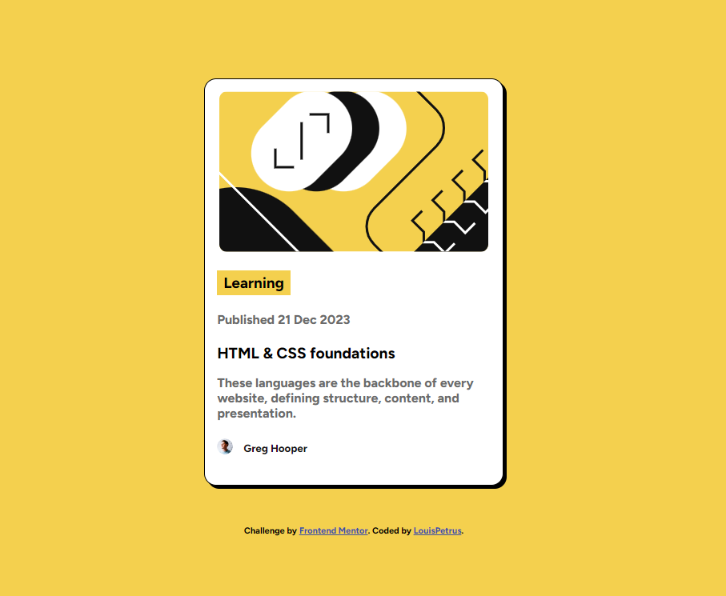

# Frontend Mentor - Blog preview card solution

This is a solution to the [Blog preview card challenge on Frontend Mentor](https://www.frontendmentor.io/challenges/blog-preview-card-ckPaj01IcS). Frontend Mentor challenges help you improve your coding skills by building realistic projects. 

## Table of contents

- [Overview](#overview)
  - [Screenshot](#screenshot)
  - [Links](#links)
- [My process](#my-process)
  - [Built with](#built-with)
  - [What I learned](#what-i-learned)
  - [Continued development](#continued-development)
  - [Useful resources](#useful-resources)
- [Author](#author)
- [Acknowledgments](#acknowledgments)

## Overview

Block Preview Card Design

### Screenshot



### Links

- Solution URL: [Add solution URL here](https://your-solution-url.com)
- Live Site URL: (https://blog-preview-card-tau-teal.vercel.app/)

## My process

I first of all colored the backgroung. Then used the div tag to create a white background section where the rest of the content are arranged. I imported the image next and gave it the box shadow tag and the arranged and colored all the texts with their respective tags and colors.
### Built with

- Semantic HTML5 markup
- CSS custom properties
- Flexbox
- CSS Grid

### What I learned

I learnt how to use the span element to design a particular text in the midst of other elements. Also mastered making my designs mobile sensitive.

```html
<h1>Some HTML code I'm proud of</h1>
The <div> tag
```css
.proud-of-this-css {
  color: papayawhip;
}
border redius element

### Continued development

I need to improve more on importing font-family and image positioning as well.

### Useful resources

- [Example resource 1](https://www.w3schools.com/css/tryit.asp?filename=trycss_vertical-align) - This is used to position images on texts. I really liked this pattern and will use it going forward.

## Author

- Frontend Mentor - [@MaxBidder76](https://www.frontendmentor.io/profile/MaxBidder76)

## Acknowledgments

Thank God for more lessons learned.
